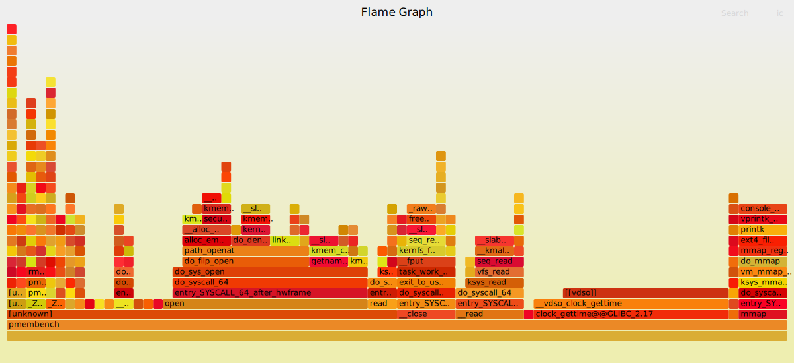
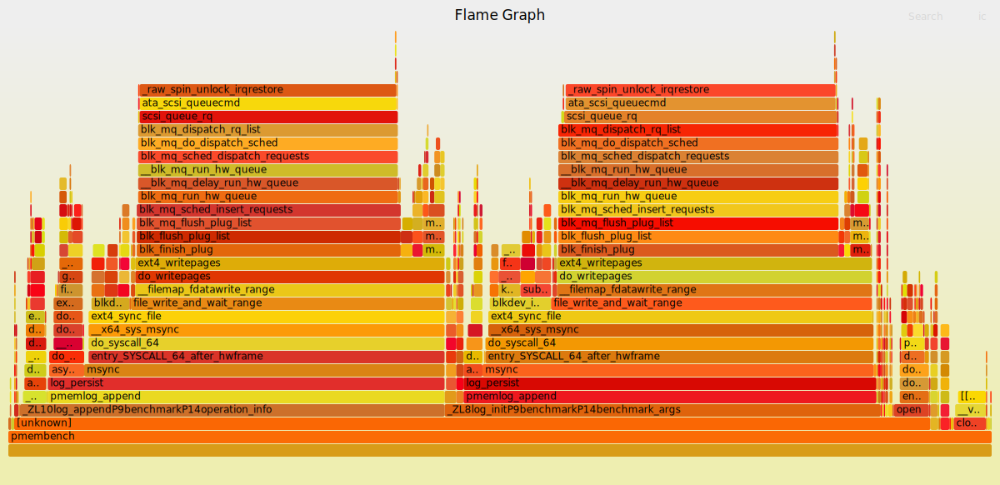

# Evaluation for pVFS

This repo contains evaluation scripts and benchmarks to evaluate pVFS.

```
.
|-- README.md
|-- deps            # Dependencies
|-- scripts         # Scripts to compile code, run experiments, collect data
`-- src             # Source of pVFS
```

## Compile

Clone the submodules.

```
git submodule update --init --recursive
```

TODO: compile PMDK and pVFS.

## Profiling

TODO: profiling instrucitons goes here.

## Generate Graphs

TODO: use scripts to process data.


### Example Results

TODO: explain example results

||
|:--:|
|Figure 1: PMDK on DAX file.  Total execution time is ~1s.|

||
|:--:|
|Figure 2: PMDK on non-DAX file.  Total execution time is ~180s.|
